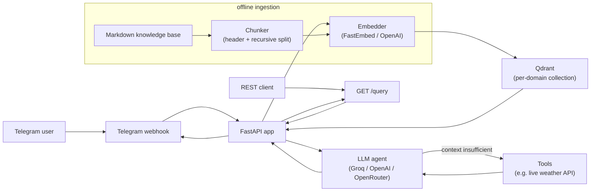

# fastRAG

A production-shaped Retrieval-Augmented Generation service: it indexes Markdown knowledge bases into Qdrant and answers natural-language questions through a REST API and a Telegram bot, backed by tool-calling LLM agents that fall back to live tools when the retrieved context isn't enough.

Currently serves two independently selectable knowledge domains — **Bangladeshi law** and **public health/medicine** — each with its own vector collection, system prompt, and retrieval scope, demonstrating the multi-tenant/multi-domain pattern rather than a single hard-coded corpus.

Built provider-agnostic from the ground up: every LLM, embedding model, and chunker sits behind its own interface, so the stack swaps providers or scales to new domains without touching core logic.

## Architecture



Each domain (`law`, `health`) maps to its own Qdrant collection, system prompt, and Markdown source folder, so retrieval never leaks context across domains. A user picks a domain once (via Telegram command or the `domain` query param) and every subsequent query is scoped to it.

## Features

- 🧠 **Swappable LLM backends** — Groq, OpenAI, and OpenRouter (with automatic model fallback) behind one interface, picked at runtime
- 🔎 **Swappable embedding models** — local FastEmbed or OpenAI embeddings behind one interface
- 🛠️ **Agentic tool calling** — the LLM only invokes tools (e.g. live weather lookup) when the retrieved context can't answer the question
- 📄 **Pluggable ingestion pipeline** — file-type-aware chunking (header-aware Markdown splitting + recursive size splitting), extensible to new formats via a simple base-class contract
- ♻️ **Idempotent re-ingestion** — chunk IDs are deterministically derived from `source + text`, so re-running ingestion after editing a doc updates its vector in place instead of duplicating it
- 🤖 **Telegram bot** — webhook-driven chat interface with per-chat, in-memory domain selection
- 🔀 **Multi-domain RAG** — pluggable knowledge domains, each with its own vector collection and system prompt
- 🐳 **Containerized** — one-command deploy with Docker Compose, with ingestion run as a separate on-demand profile

## Tech Stack

**API & Runtime:** Python · FastAPI · Uvicorn · Pydantic

**AI / RAG:** Qdrant (vector DB) · FastEmbed · LangChain · Groq · OpenAI · OpenRouter

**Messaging:** Telegram Bot API

**Infra:** Docker · Docker Compose

## Project Structure

```
app/
├── main.py                        # FastAPI app, /query and /webhook/telegram routes
├── ingest.py                      # offline ingestion entrypoint (per-domain)
├── config.py                      # env-driven settings (pydantic-settings)
├── domains.py                     # domain registry: label, source path, collection, system prompt
└── services/
    ├── embedding_services/        # BaseEmbeddingsService + FastEmbed / OpenAI implementations
    ├── llm_services/              # BaseLLMService (tool-calling loop) + Groq / OpenAI / OpenRouter
    ├── chunking_services/         # BaseChunkerService + Markdown header-aware chunker
    ├── tool_services/             # LLM-callable tools (e.g. weather lookup)
    ├── messaging_services/        # BaseMessagingService + Telegram implementation
    ├── telegram_formatting.py     # Markdown sanitization for Telegram's renderer
    └── vector_store_service.py    # Qdrant client wrapper (collections, upsert, filtered search)
knowledge_base/
├── law/                           # Bangladeshi law & constitution source docs
└── health/                        # public health & medicine source docs
scripts/fetch_wikipedia_kb.py      # helper to build the source Markdown docs from Wikipedia
```

## Getting Started

### Prerequisites

- Docker & Docker Compose (recommended), **or** Python 3.10+ and a running Qdrant instance
- At least one LLM provider API key (Groq, OpenAI, or OpenRouter)
- A Telegram bot token if you want the chat interface (optional)

### Environment variables

Create a `.env` file in the project root:

| Variable | Description | Default |
|---|---|---|
| `GROQ_API_KEY` / `GROQ_MODEL` | Groq LLM credentials + model | `llama-3.1-8b-instant` |
| `OPENAI_API_KEY` / `OPENAI_MODEL` | OpenAI LLM credentials + model | `gpt-4o-mini` |
| `OPENAI_EMBEDDING_MODEL` | OpenAI embedding model (if used instead of local FastEmbed) | `text-embedding-3-small` |
| `OPENROUTER_API_KEY` / `OPENROUTER_PRIMARY_MODEL` / `OPENROUTER_FALLBACK_MODEL` | OpenRouter credentials + primary/fallback models | `openai/gpt-oss-20b` / `openrouter/free` |
| `TELEGRAM_BOT_TOKEN` | Telegram bot token for the webhook integration | — |
| `QDRANT_URL` | Qdrant connection URL | `http://localhost:6333` |
| `CHUNK_SIZE` / `CHUNK_OVERLAP` | Text-splitter chunk sizing | `500` / `50` |

The active LLM provider is selected in `app/main.py` (swap which `*LLMService()` is instantiated); only that provider's key is required.

### Run with Docker Compose

```bash
# 1. Start Qdrant + the API
docker compose up -d --build

# 2. Ingest the knowledge base into Qdrant (run once, or after editing docs)
docker compose --profile ingest run --rm ingest
```

The API is now available at `http://localhost:8000`.

### Run locally

```bash
pip install -r requirements.txt

# start Qdrant separately, e.g.:
docker run -p 6333:6333 qdrant/qdrant:v1.19.0

python -m app.ingest              # index the knowledge base
uvicorn app.main:app --reload     # start the API
```

## API

### `GET /query`

```bash
curl "http://localhost:8000/query?query=What+are+the+fundamental+rights+in+the+constitution&domain=law&top_k=5"
```

```json
{
  "query": "What are the fundamental rights in the constitution",
  "domain": "law",
  "answers": "...",
  "tools_used": [],
  "sources": [{ "source": "fundamental_rights_of_the_people_of_bangladesh.md", "text": "..." }],
  "time_taken": 1.42,
  "retrieval_time": 0.08,
  "llm_generation_time": 1.34
}
```

| Param | Required | Description |
|---|---|---|
| `query` | yes | Natural-language question |
| `domain` | no | `law` (default) or `health` |
| `top_k` | no | Number of chunks to retrieve (default `5`) |
| `source` | no | Restrict retrieval to a specific source filename |

### `POST /webhook/telegram`

Point your Telegram bot's webhook at this endpoint. Users send `/law`, `/health`, or `/menu` to pick a domain, then chat normally — each message is answered against the currently selected domain's knowledge base.

## Adding a New Domain

1. Drop Markdown files into a new folder under `knowledge_base/`
2. Register the domain in `app/domains.py` (label, path, collection name, system prompt)
3. Run ingestion: `python -m app.ingest`

No other code changes are required — routing, the Telegram menu, and retrieval all read from the domain registry.

## License

MIT
